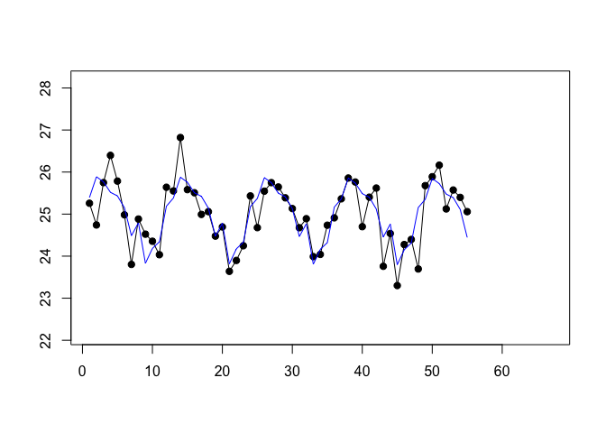
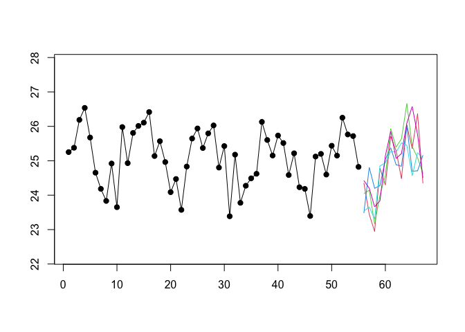
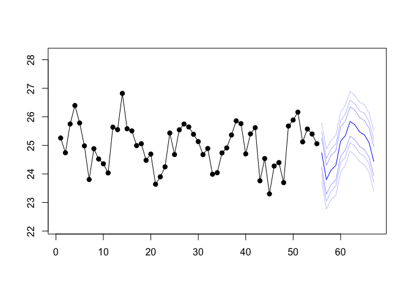

<!-- README.md is generated from README.Rmd. Please edit that file -->

# heuristika 0.0.0.9000

<!-- badges: start -->

<!-- badges: end -->

The goal of heuristika is to provide a computationally and
outlier-robust implementation of a subset of exponential smoothing-based
models that allows for manual overwrites.

Main characteristics of heuristika are:

  - Lightweight with regard to dependencies
  - Computational robustness
  - Based on Exponential Smoothing models (additive trend, seasonality,
    error)
  - Forecasts via sample path generation
  - User-controllable robust handling of “outliers” as part of model
    fitting
  - User-controllable initial states that could be shared across time
    series to share hierarchical information (possible due to
    standardization of time series)
  - User-controllable parameter grid combined with custom penalized loss
    functions
  - Choice of “likelihood function” for the error component

The implementation is based on a bunch of heuristics. Thus the name.

## Installation

You can install the development version of heuristika from
[GitHub](https://github.com/) with:

``` r
# install.packages("devtools")
devtools::install_github("timradtke/heuristika")
```

## Example

This is a basic example which shows you how to solve a common problem:

``` r
library(heuristika)

y <- rnorm(55, mean = 25 + sinpi(1:55 / 6), sd = 0.5)

fitted_model <- heuristika::fit(y = y, m = 12, family = "norm")
```



``` r
fc <- heuristika::forecast(object = fitted_model, h = 12, n = 5000)
```

``` r
plot(x = 1:67, y = c(y, rep(NA, 12)), pch = 19, 
     ylim = c(min(y)*0.95, max(y)*1.05),
     xlab = NA, ylab = NA)
lines(1:67, c(y, rep(NA, 12)))

for (j in 1:5) {
  lines(56:67, fc[, j], col = j + 1)
}
```



``` r
quantiles <- c(0.01, 0.05, 0.13, 0.5, 0.87, 0.95, 0.99)

plot(x = 1:67, y = c(y, rep(NA, 12)), pch = 19, 
     ylim = c(min(y)*0.95, max(y)*1.05),
     xlab = NA, ylab = NA)
lines(x = 1:67, y = c(y, rep(NA, 12)))
for (j in seq_along(quantiles)) {
  lines(
    x = 56:67, 
    y = apply(fc, quantile, MARGIN = 1, quantiles[j], na.rm = TRUE), 
    col = rgb(red = 0, green = 0, blue = 1, 
              alpha = 1 - abs(0.5 - quantiles[j])),
    lwd = 1 - abs(0.5 - quantiles[j])
    )
}
```



## References

Michael Bohlke-Schneider, Shubham Kapoor, Tim Januschowski (2020).
*Resilient Neural Forecasting Systems*.
<https://www.amazon.science/publications/resilient-neural-forecasting-systems>

Ruben Crevits and Christophe Croux (2017). *Forecasting using Robust
Exponential Smoothing with Damped Trend and Seasonal Components*.
KBI\_1741, <https://dx.doi.org/10.2139/ssrn.3068634>

Rob J. Hyndman and George Athanasopoulos (2021). *Forecasting:
Principles and Practice*. 3rd edition, OTexts: Melbourne, Australia.
<https://otexts.com/fpp3/>

Rob J. Hyndman, Anne B. Koehler, Ralph D. Snyder, and Simone Grose
(2002). *A State Space Framework for Automatic Forecasting using
Exponential Smoothing Methods*.
<https://doi.org/10.1016/S0169-2070(01)00110-8>

Rafael de Rezende, Katharina Egert, Ignacio Marin, Guilherme Thompson
(2021). *A White-boxed ISSM Approach to Estimate Uncertainty
Distributions of Walmart Sales*. <https://arxiv.org/abs/2111.14721>
