<!-- README.md is generated from README.Rmd. Please edit that file -->

# tulip 

<!-- badges: start -->
<!-- badges: end -->

**Version: 0.0.0.9000**

Use `tulip` to produce robust probabilistic forecasts of business time
series.

The main features of `tulip` are:

-   [x] User-controllable robust handling of anomalous observations
    integrated into model fitting
-   [x] Probabilistic forecasts with sample paths as native output
    (great for downstream optimization of decision problems!)
-   [x] Option to bootstrap sample paths for asymmetric forecast
    distributions
-   [x] Based on exponential smoothing models (additive error, additive
    trend, additive or multiplicative seasonality)
-   [x] User-controllable initial states that can be shared across time
    series to transfer information from one series to others (e.g. to
    apply a seasonal component also to short time series)
-   [x] User-controllable set of allowed parameter combinations to
    restrict optimization to robust model choices
-   [x] Model fit using maximum-a-posterioi estimation to allow for
    specification of prior distributions
-   [x] User-controllable prior distributions that specify which
    parameter combinations are expected to be reasonable
-   [x] Fast installation due to lightweight dependencies, no C++

With `tulip`, it is easy to generate a robust forecast out-of-the-box
due to sane defaults. But users can also choose to overwrite those
defaults to tune `tulip` to their problem. Due to the wide API surface
of its fitting and prediction methods, `tulip` allows users to exploit
their knowledge of their problem and data to get the most out of their
forecasts.

If most forecasting packages are modern cars that hide their engine and
that you can’t repair when they break down, `tulip` is the car that
brings you where you need to go and that you can tinker with in your
garage.

## Installation

You can install the development version of tulip from
[GitHub](https://github.com/) with:

``` r
# install.packages("devtools")
devtools::install_github("timradtke/tulip")
```

Written in pure R, and with the `checkmate` package as the only direct
dependency, installing `tulip` is a breeze.

## Get Started

For starters, let’s use a data set available in base R: `AirPassengers`.
It’s not exactly something where `tulip` has any particular advantage,
but it’s a classic.

We keep the twelve most recent observations as holdout.

``` r
y <- as.numeric(AirPassengers)

y_train <- y[1:(length(y) - 12)]
y_test <- y[(length(y) - 12 + 1):length(y)]
```

### Fitting a `tulip` Model

Fitting a `tulip` model is as simple as providing the time series `y`
and a suspected seasonal period length `m`. We cheat in the same way
everyone else cheats and use our knowledge of the `AirPassengers` data
to choose a `multiplicative` seasonal component. All other arguments are
left at their default values.

``` r
library(tulip)

fitted_model <- tulip::tulip(
  y = y_train,
  m = 12,
  method = "multiplicative"
)
```

If `ggplot2` is available, you can use its `autoplot()` to visualize the
fitted model. By default, the different model components are visualized.

``` r
library(ggplot2)
autoplot(fitted_model)
```

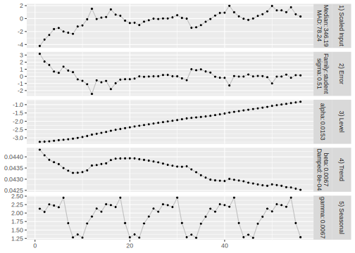

Alternatively, you can display the fitted values (transparent points)
against the input time series (black points). Potential anomalous
observations are marked in orange.

``` r
autoplot(fitted_model, method = "fitted")
```

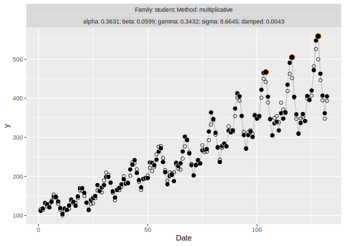

While the `tulip` specification chosen here uses a multiplicative
seasonal component, the error component is additive, which explains why
the model does not fit the most recent seasonal peaks well (and instead
treats them as anomalies).

### Forecasting with `tulip`

Just use `predict()` on the fitted model to generate sample paths from
the forecast distribution:

``` r
forecast <- predict(object = fitted_model, h = 12, n = 10000)
```

The returned `forecast` object has it’s own `tulip_paths` class which
can again be plotted using `autoplot()`. We also add the holdout period
on top of the forecast interval.

``` r
autoplot(forecast) +
  geom_point(
    data = data.frame(
      date = (length(y)-11):length(y),
      value = y_test
    ),
    mapping = aes(x = date, y = value), 
    pch = 21, color = "white", fill = "darkorange"
  )
```

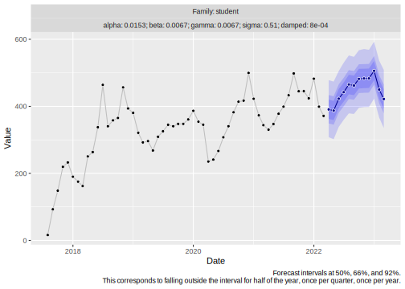

This graph hides, however, that sample paths from the joint forecast
distribution are the native output of `tulip`s `predict` method—in
contrast to the usual point forecasts or pre-aggregated quantiles.

The sample paths can be accessed via the `paths` matrix of dimensions
`h` by `n`:

``` r
dim(forecast$paths)
#> [1]    12 10000
```

These are the five first forecast paths, representing five predicted
possible future paths of the time series given the fitted model.

``` r
round(forecast$paths[, 1:5])
#>       [,1] [,2] [,3] [,4] [,5]
#>  [1,]  415  429  423  425  420
#>  [2,]  407  404  393  395  393
#>  [3,]  476  460  466  475  461
#>  [4,]  484  481  456  462  473
#>  [5,]  492  510  487  472  483
#>  [6,]  556  588  554  547  545
#>  [7,]  614  655  630  624  661
#>  [8,]  581  620  577  581  569
#>  [9,]  525  561  514  531  513
#> [10,]  458  482  432  465  438
#> [11,]  407  399  390  415  377
#> [12,]  449  472  435  452  438
```

A random sample of five forecast paths can be plotted by choosing the
`method = "paths"`.

``` r
autoplot(forecast, method = "paths")
```

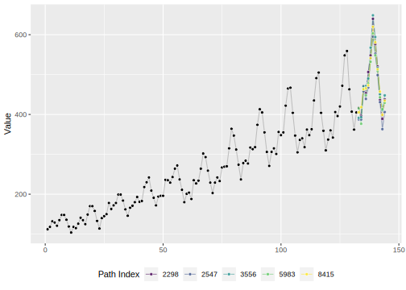

## Resex Data

Forecasts from state space models [can be susceptible to anomalous
observations](https://minimizeregret.com/post/2022/07/05/state-space-model-intricacies/).
Especially when more recent observations are surprisingly different from
previous observations, state space models can pick up large trends. In
reality, however, those trends do not realize, leading to very poor
forecasts.

The Resex series (available in the `RobStatTM` package) is a good
example of a series where outliers towards the end would usually lead to
heavily distorted forecasts.

``` r
library(RobStatTM)

y <- resex[1:(length(resex)-5)]
dates_resex <- seq(as.Date("1966-01-01"), as.Date("1972-12-01"), by = "month")
dates_resex_future <- seq(as.Date("1973-01-01"), as.Date("1973-05-01"), by = "month")
```

### Forecasting Resex with `tulip`

``` r
fitted_model <- tulip::tulip(y = y, m = 12)
```

The fitted values (transparent points) for the Resex series are:

``` r
autoplot(fitted_model, method = "fitted", date = dates_resex)
```

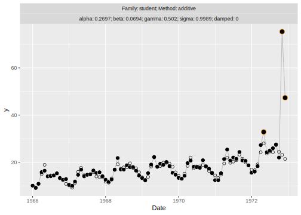

We can use bootstrap-based sample paths to derive prediction intervals:

``` r
fitted_model$family <- "bootstrap"

forecast <- predict(
  object = fitted_model,
  h = 5,
  n = 10000
)
```

``` r
autoplot(forecast, date = dates_resex, date_future = dates_resex_future) +
  geom_point(
    data = data.frame(date = dates_resex_future,
                      value = resex[(length(resex)-4):length(resex)]),
    mapping = aes(x = date, y = value), 
    pch = 21, color = "white", fill = "darkorange"
  )
```

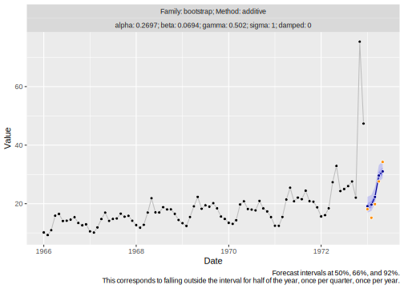

### Forecasting Resex with Standard Structural Time Series Models

In contrast, let’s take a look at the base R implementation of
structural time series models, via `stats::StructTS()`. Because of the
suspected seasonality, we choose the “BSM” type to fit a local trend
model with seasonal component.

``` r
fitted_model_structts <- stats::StructTS(
  x = ts(y, frequency = 12),
  type = "BSM"
)

forecast_structts <- predict(
  object = fitted_model_structts,
  n.ahead = 5
)
```

This model’s level adjusts hard to the most recent observations as it
has no concept of anomalies. It fits all observations as well as
possible. This produces unfortunate forecasts in this case.

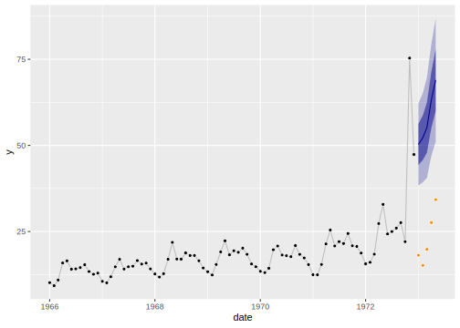

### Using the `flowers` Example Data Instead

The `tulip` package contains a synthetic example dataset that can be
used to illustrate the same point.

``` r
fitted_model <- tulip::tulip(y = tulip::flowers$flowers, m = 12)
autoplot(fitted_model, method = "fitted", date = tulip::flowers$date)
```

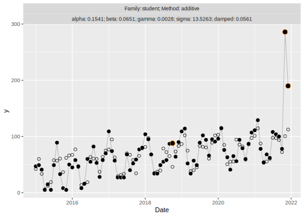

``` r
fitted_model$family <- "bootstrap"

forecast <- predict(
  object = fitted_model,
  h = 12,
  n = 10000
)
```

``` r
autoplot(forecast,
         date = tulip::flowers$date, 
         date_future = tulip::flowers_holdout$date) +
  geom_point(
    data = tulip::flowers_holdout,
    mapping = aes(x = date, y = flowers), 
    pch = 21, color = "white", fill = "darkorange"
  )
```

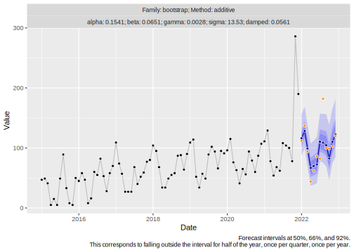

## Forecasting Count and Intermittent Data

The `tulip` package generates its forecasts natively based on drawing
sample paths from the underlying model specification. This provides an
estimate of the joint distribution across all future periods.

The generation of sample paths is inherently iterative. The sample of
the one-step-ahead forecast is fed back into the model, to generate the
sample for the two-step-ahead forecast.

The `predict()` method lets users hook into this sampling process using
the `postprocess_sample` argument. Users can provide a function that is
applied on the current j-step-ahead vector of samples *before* it is fed
back into the model. This allows users to adjust the data generating
process–for example, to enforce non-negative count samples–while doing
so before the state components (level, trend, seasonality) of the model
are updated given the most recent sample. This prevents the model’s
level from drifting to zero.

``` r
set.seed(5573)
y <- rpois(n = 28, lambda = 2)
```

``` r
fitted_model <- tulip::tulip(y = y, m = 12)
```

``` r
forecast <- predict(
  object = fitted_model,
  h = 12,
  n = 10000,
  postprocess_sample = function(x) round(pmax(0, x))
)

autoplot(forecast)
```

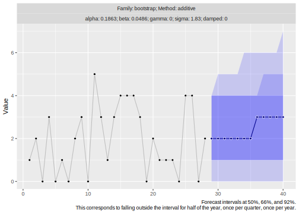

The impact of the sample postprocessing becomes especially clear when
visualizing the sample paths themselves.

``` r
autoplot(forecast, method = "paths")
```

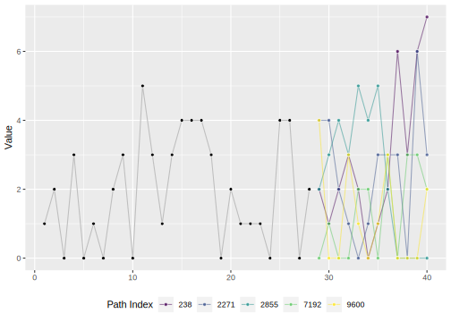

## References

Alexander Alexandrov, Konstantinos Benidis, Michael Bohlke-Schneider,
Valentin Flunkert, Jan Gasthaus, Tim Januschowski, Danielle C. Maddix,
Syama Rangapuram, David Salinas, Jasper Schulz, Lorenzo Stella, Ali
Caner Türkmen, Yuyang Wang (2019). *GluonTS: Probabilistic Time Series
Models in Python*. <https://arxiv.org/abs/1906.05264>

James Bergstra, Yoshua Bengio (2012). *Random Search for Hyper-Parameter
Optimization*.
<https://www.jmlr.org/papers/volume13/bergstra12a/bergstra12a.pdf>

Michael Bohlke-Schneider, Shubham Kapoor, Tim Januschowski (2020).
*Resilient Neural Forecasting Systems*.
<https://www.amazon.science/publications/resilient-neural-forecasting-systems>

Devon Barrow, Nikolaos Kourentzes, Rickard Sandberg, Jacek Niklewski
(2020). *Automatic robust estimation for exponential smoothing:
Perspectives from statistics and machine learning*.
<https://doi.org/10.1016/j.eswa.2020.113637>

Ruben Crevits and Christophe Croux (2017). *Forecasting using Robust
Exponential Smoothing with Damped Trend and Seasonal Components*.
<https://dx.doi.org/10.2139/ssrn.3068634>

Roland Fried (2004). *Robust Filtering of Time Series with Trends*.
<https://doi.org/10.1080/10485250410001656444>

Sarah Gelper, Roland Fried, Cristophe Croux (2007). *Robust Forecasting
with Exponential and Holt-Winters Smoothing*.
<http://dx.doi.org/10.2139/ssrn.1089403>

Andrew C. Harvey (1990). *Forecasting, Structural Time Series Models and
the Kalman Filter*. <https://doi.org/10.1017/CBO9781107049994>

C. E. Holt (1957). *Forecasting Seasonals and Trends by Exponentially
Weighted Averages*. <https://doi.org/10.1016/j.ijforecast.2003.09.015>

Rob J. Hyndman and George Athanasopoulos (2021). *Forecasting:
Principles and Practice*. 3rd edition, OTexts: Melbourne, Australia.
<https://otexts.com/fpp3/>

Rob J. Hyndman, Anne B. Koehler, Ralph D. Snyder, and Simone Grose
(2002). *A State Space Framework for Automatic Forecasting using
Exponential Smoothing Methods*.
<https://doi.org/10.1016/S0169-2070(01)00110-8>

Edwin Ng, Zhishi Wang, Huigang Chen, Steve Yang, Slawek Smyl (2021).
*Orbit: Probabilistic Forecast with Exponential Smoothing*.
<https://arxiv.org/abs/2004.08492>

Syama Sundar Rangapuram, Matthias W. Seeger, Jan Gasthaus, Lorenzo
Stella, Yuyang Wang, Tim Januschowski (2018). *Deep State Space Models
for Time Series Forecasting*.
<https://papers.nips.cc/paper/2018/hash/5cf68969fb67aa6082363a6d4e6468e2-Abstract.html>

Rafael de Rezende, Katharina Egert, Ignacio Marin, Guilherme Thompson
(2021). *A White-boxed ISSM Approach to Estimate Uncertainty
Distributions of Walmart Sales*. <https://arxiv.org/abs/2111.14721>

Steven L. Scott, Hal Varian (2013). *Predicting the Present with
Bayesian Structural Time Series*.
<https://research.google/pubs/pub41335>

Matthias Seeger, David Salinas, Valentin Flunkert (2016). *Bayesian
Intermittent Demand Forecasting for Large Inventories*.
<https://papers.nips.cc/paper/2016/hash/03255088ed63354a54e0e5ed957e9008-Abstract.html>

Matthias Seeger, Syama Rangapuram, Yuyang Wang, David Salinas, Jan
Gasthaus, Tim Januschowski, Valentin Flunkert (2017). *Approximate
Bayesian Inference in Linear State Space Models for Intermittent Demand
Forecasting at Scale*. <https://arxiv.org/abs/1709.07638>

Slawek Smyl, Qinqin Zhang (2015). *Fitting and Extending Exponential
Smoothing Models with Stan*.
<https://forecasters.org/wp-content/uploads/gravity_forms/7-621289a708af3e7af65a7cd487aee6eb/2015/07/Smyl_Slawek_ISF2015.pdf>

Slawek Smyl, Christoph Bergmeir, Erwin Wibowo, To Wang Ng (2022). *Rlgt:
Bayesian Exponential Smoothing Models with Trend Modifications*.
<https://cran.r-project.org/web/packages/Rlgt/index.html>

Qingsong Wen, Jingkun Gao, Xiaomin Song, Liang Sun, Huan Xu, Shenghuo
Zhu (2018). *RobustSTL: A Robust Seasonal-Trend Decomposition Algorithm
for Long Time Series*. <https://arxiv.org/abs/1812.01767>

P. R. Winters (1960). *Forecasting Sales by Exponentially Weighted
Moving Averages*. <https://doi.org/10.1287/mnsc.6.3.324>
