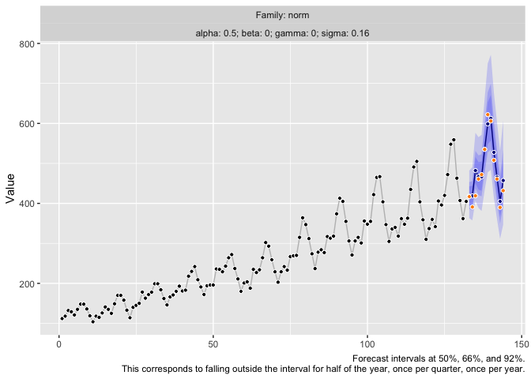
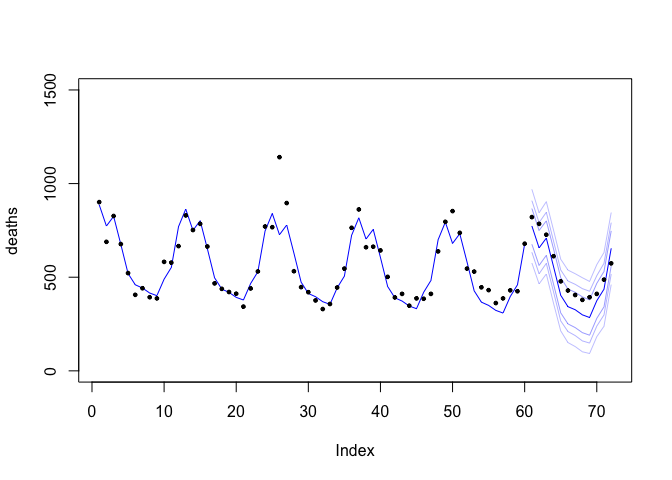
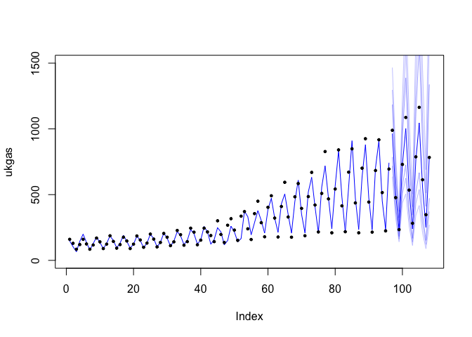

<!-- README.md is generated from README.Rmd. Please edit that file -->

# heuristika 

<!-- badges: start -->

<!-- badges: end -->

**Version: 0.0.0.9000**

The goal of heuristika is to provide a computationally and
outlier-robust implementation of a subset of exponential smoothing-based
models that allows for manual overwrites.

Main characteristics of heuristika are:

  - Lightweight with regard to dependencies
  - Computational robustness
  - Based on Exponential Smoothing models (additive trend, seasonality,
    error)
  - Forecasts via sample path generation
  - User-controllable robust handling of “outliers” as part of model
    fitting
  - User-controllable initial states that could be shared across time
    series to share hierarchical information (possible due to
    standardization of time series)
  - User-controllable parameter grid combined with custom penalized loss
    functions
  - Choice of “likelihood function” for the error component

The implementation is based on a bunch of heuristics. Thus the name.

## Installation

You can install the development version of heuristika from
[GitHub](https://github.com/) with:

``` r
# install.packages("devtools")
devtools::install_github("timradtke/heuristika")
```

## Example

This is a basic example which shows you how to solve a common problem:

``` r
library(heuristika)

y <- rnorm(55, mean = 25 + sinpi(1:55 / 6), sd = 0.5)

fitted_model <- heuristika::heuristika(y = y, m = 12, family = "auto")
```


``` r
fc <- heuristika::draw_paths(
  object = fitted_model, 
  h = 12, 
  n = 10000
)
```

``` r
plot(x = 1:67, y = c(y, rep(NA, 12)), pch = 19, 
     ylim = c(min(y)*0.95, max(y)*1.05),
     xlab = NA, ylab = NA)
lines(1:67, c(y, rep(NA, 12)))

for (j in 1:5) {
  lines(56:67, fc[, j], col = j + 1)
}
```


``` r
quantiles <- c(0.01, 0.05, 0.13, 0.5, 0.87, 0.95, 0.99)

plot(x = 1:67, y = c(y, rep(NA, 12)), pch = 19, 
     ylim = c(min(y)*0.95, max(y)*1.05),
     xlab = NA, ylab = NA)
lines(x = 1:67, y = c(y, rep(NA, 12)))
for (j in seq_along(quantiles)) {
  lines(
    x = 56:67, 
    y = apply(fc, quantile, MARGIN = 1, quantiles[j], na.rm = TRUE), 
    col = rgb(red = 0, green = 0, blue = 1, 
              alpha = 1 - abs(0.5 - quantiles[j])),
    lwd = 1 - abs(0.5 - quantiles[j])
    )
}
```


## AirPassengers

``` r
air_passengers <- log1p(as.numeric(AirPassengers))
ap_n <- length(air_passengers)

tictoc::tic()
ap_fit <- heuristika::heuristika(
  y = air_passengers[1:(ap_n-12)], m = 12, family = "norm"
)
tictoc::toc()
#> 1.365 sec elapsed

tictoc::tic()
ap_fc <- heuristika::draw_paths(object = ap_fit, h = 12, n = 10000)
tictoc::toc()
#> 0.174 sec elapsed
```



## deaths

``` r
deaths <- as.numeric(fdeaths)
d_n <- length(deaths)

tictoc::tic()
d_fit <- heuristika::heuristika(
  y = deaths[1:(d_n-12)], m = 12, family = "norm", 
)
tictoc::toc()
#> 0.423 sec elapsed

tictoc::tic()
d_fc <- heuristika::draw_paths(
  object = d_fit, 
  h = 12, 
  n = 10000,
  switch_to_cauchy_if_outliers = FALSE
)
tictoc::toc()
#> 0.101 sec elapsed
```



## UKgas

``` r
ukgas <- as.numeric(UKgas)
ug_n <- length(ukgas)

tictoc::tic()
ug_fit <- heuristika::heuristika(
  y = log1p(ukgas[1:(ug_n-12)]), m = 4, family = "norm", 
)
tictoc::toc()
#> 0.778 sec elapsed

tictoc::tic()
ug_fc <- heuristika::draw_paths(
  object = ug_fit, 
  h = 12, 
  n = 10000,
  switch_to_cauchy_if_outliers = FALSE
)
tictoc::toc()
#> 0.151 sec elapsed
```



## References

Michael Bohlke-Schneider, Shubham Kapoor, Tim Januschowski (2020).
*Resilient Neural Forecasting Systems*.
<https://www.amazon.science/publications/resilient-neural-forecasting-systems>

Ruben Crevits and Christophe Croux (2017). *Forecasting using Robust
Exponential Smoothing with Damped Trend and Seasonal Components*.
<https://dx.doi.org/10.2139/ssrn.3068634>

Andrew C. Harvey (1990). *Forecasting, Structural Time Series Models and
the Kalman Filter*. <https://doi.org/10.1017/CBO9781107049994>

C. E. Holt (1957). *Forecasting Seasonals and Trends by Exponentially
Weighted Averages*. <https://doi.org/10.1016/j.ijforecast.2003.09.015>

Rob J. Hyndman and George Athanasopoulos (2021). *Forecasting:
Principles and Practice*. 3rd edition, OTexts: Melbourne, Australia.
<https://otexts.com/fpp3/>

Rob J. Hyndman, Anne B. Koehler, Ralph D. Snyder, and Simone Grose
(2002). *A State Space Framework for Automatic Forecasting using
Exponential Smoothing Methods*.
<https://doi.org/10.1016/S0169-2070(01)00110-8>

Edwin Ng, Zhishi Wang, Huigang Chen, Steve Yang, Slawek Smyl (2021).
*Orbit: Probabilistic Forecast with Exponential Smoothing*.
<https://arxiv.org/abs/2004.08492>

Rafael de Rezende, Katharina Egert, Ignacio Marin, Guilherme Thompson
(2021). *A White-boxed ISSM Approach to Estimate Uncertainty
Distributions of Walmart Sales*. <https://arxiv.org/abs/2111.14721>

Steven L. Scott, Hal Varian (2013). *Predicting the Present with
Bayesian Structural Time Series*.
<https://research.google/pubs/pub41335>

P. R. Winters (1960). *Forecasting Sales by Exponentially Weighted
Moving Averages*. <https://doi.org/10.1287/mnsc.6.3.324>
