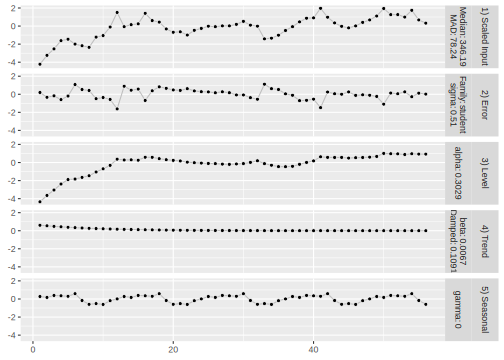
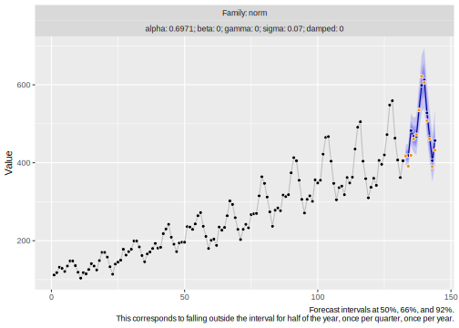

<!-- README.md is generated from README.Rmd. Please edit that file -->

# tulip 

<!-- badges: start -->

<!-- badges: end -->

**Version: 0.0.0.9000**

The goal of tulip is to provide a computationally and outlier-robust
implementation of a subset of exponential smoothing-based models that
allows for manual overwrites.

Main characteristics of tulip are:

  - Lightweight with regard to dependencies
  - Computational robustness
  - Based on Exponential Smoothing models (additive trend, seasonality,
    error)
  - Forecasts via sample path generation
  - User-controllable robust handling of “outliers” as part of model
    fitting
  - User-controllable initial states that could be shared across time
    series to share hierarchical information (possible due to
    standardization of time series)
  - User-controllable parameter grid combined with custom penalized loss
    functions
  - Choice of “likelihood function” for the error component

## Installation

You can install the development version of tulip from
[GitHub](https://github.com/) with:

``` r
# install.packages("devtools")
devtools::install_github("timradtke/tulip")
```

## Example

Let’s first create some example data:

``` r
set.seed(512)

n <- 56
h <- 12

start_date <- as.Date(paste0(format(Sys.Date(), "%Y-%m"), "-01"))
dates <- seq(
  lubridate::`%m-%`(start_date, months(n-1)), 
  start_date, 
  by = "month"
)
dates_future <- seq(
  lubridate::`%m+%`(start_date, months(1)), 
  lubridate::`%m+%`(start_date, months(h)),
  by = "month"
)
```

``` r
tmp_trend <- log(1:n) * 100
tmp_season <- sinpi(1:n / 6) * 50

y <- rep(NA, n)
for (i in 1:n) {
  y[i] <- 0.4 * rt(n = 1, df = 2) * 50
  if (i > 1) y[i] <- 0.6 * y[i-1] + y[i]
}
y <- y + tmp_trend + tmp_season
```

### Training a `tulip` model

A `tulip` model can be fit against the series by additionally specifying
the expected period length `m` of the seasonal component.

``` r
library(tulip)

fitted_model <- tulip::tulip(y = y, m = 12, family = "student")
```

We don’t import `ggplot2` by default, but if it is made available one
can use its `autoplot` generic to visualize the fitted model as `tulip`
provides methods for its classes.

By default, `autoplot()` will show the fitted model’s components on the
internal standardized scale:

``` r
library(ggplot2)
autoplot(fitted_model)
```


Note that the scale of the components can be quite different, which
becomes clear when we fix the y-axis scale across components:

``` r
autoplot(fitted_model, scales = "fixed")
```



Alternatively, one can also display the fitted values against the input
time series:

``` r
autoplot(fitted_model, method = "fitted", date = dates)
```


### Forecasting with `tulip`

Just use `predict()` on the fitted model to generate sample paths from
the forecast distribution:

``` r
forecast <- predict(object = fitted_model, h = 12, n = 10000)
```

The returned `forecast` object has it’s own `tulip_paths` class which
can again be plotted using `autoplot()`:

``` r
autoplot(forecast, date = dates, date_future = dates_future)
```


Special about `tulip` is that sample paths from the joint forecast
distribution are the native output of `tulip`s predict method–in
contrast to, for example, the usual point forecasts or pre-aggregated
quantiles.

They can be accessed via the `paths` matrix of dimensions `h` by `n`:

``` r
dim(forecast$paths)
#> [1]    12 10000
```

These are the five first forecast paths:

``` r
round(forecast$paths[, 1:5], 1)
#>        [,1]  [,2]  [,3]  [,4]  [,5]
#>  [1,] 344.1 420.6 398.9 345.8 406.6
#>  [2,] 377.9 404.0 294.7 424.2 379.0
#>  [3,] 410.8 397.8 377.9 420.4 444.2
#>  [4,] 486.3 464.6 457.2 470.4 409.5
#>  [5,] 514.4 458.4 491.2 453.4 412.8
#>  [6,] 509.5 405.0 594.4 310.3 408.7
#>  [7,] 478.9 532.1 422.5 542.4 540.6
#>  [8,] 451.2 492.6 477.2 434.0 443.0
#>  [9,] 440.2 960.3 457.0 512.6 292.6
#> [10,] 501.8 511.1 487.7 419.3 514.8
#> [11,] 549.5 388.5 511.0 483.8 473.6
#> [12,] 446.8 311.3 425.7 428.0 408.8
```

A random sample of five forecast paths can be plotted by choosing the
`method = "paths"`:

``` r
autoplot(forecast, method = "paths", date = dates, date_future = dates_future)
```


## AirPassengers

``` r
air_passengers <- log1p(as.numeric(AirPassengers))
ap_n <- length(air_passengers)

tictoc::tic()
ap_fit <- tulip(
  y = air_passengers[1:(ap_n-12)], m = 12, family = "norm"
)
tictoc::toc()
#> 9.639 sec elapsed

tictoc::tic()
ap_fc <- predict(object = ap_fit, h = 12, n = 10000)
tictoc::toc()
#> 0.094 sec elapsed

ap_fc$paths <- expm1(ap_fc$paths)
ap_fc$model$y <- expm1(ap_fc$model$y)
```



## References

Michael Bohlke-Schneider, Shubham Kapoor, Tim Januschowski (2020).
*Resilient Neural Forecasting Systems*.
<https://www.amazon.science/publications/resilient-neural-forecasting-systems>

Ruben Crevits and Christophe Croux (2017). *Forecasting using Robust
Exponential Smoothing with Damped Trend and Seasonal Components*.
<https://dx.doi.org/10.2139/ssrn.3068634>

Andrew C. Harvey (1990). *Forecasting, Structural Time Series Models and
the Kalman Filter*. <https://doi.org/10.1017/CBO9781107049994>

C. E. Holt (1957). *Forecasting Seasonals and Trends by Exponentially
Weighted Averages*. <https://doi.org/10.1016/j.ijforecast.2003.09.015>

Rob J. Hyndman and George Athanasopoulos (2021). *Forecasting:
Principles and Practice*. 3rd edition, OTexts: Melbourne, Australia.
<https://otexts.com/fpp3/>

Rob J. Hyndman, Anne B. Koehler, Ralph D. Snyder, and Simone Grose
(2002). *A State Space Framework for Automatic Forecasting using
Exponential Smoothing Methods*.
<https://doi.org/10.1016/S0169-2070(01)00110-8>

Edwin Ng, Zhishi Wang, Huigang Chen, Steve Yang, Slawek Smyl (2021).
*Orbit: Probabilistic Forecast with Exponential Smoothing*.
<https://arxiv.org/abs/2004.08492>

Rafael de Rezende, Katharina Egert, Ignacio Marin, Guilherme Thompson
(2021). *A White-boxed ISSM Approach to Estimate Uncertainty
Distributions of Walmart Sales*. <https://arxiv.org/abs/2111.14721>

Steven L. Scott, Hal Varian (2013). *Predicting the Present with
Bayesian Structural Time Series*.
<https://research.google/pubs/pub41335>

P. R. Winters (1960). *Forecasting Sales by Exponentially Weighted
Moving Averages*. <https://doi.org/10.1287/mnsc.6.3.324>
